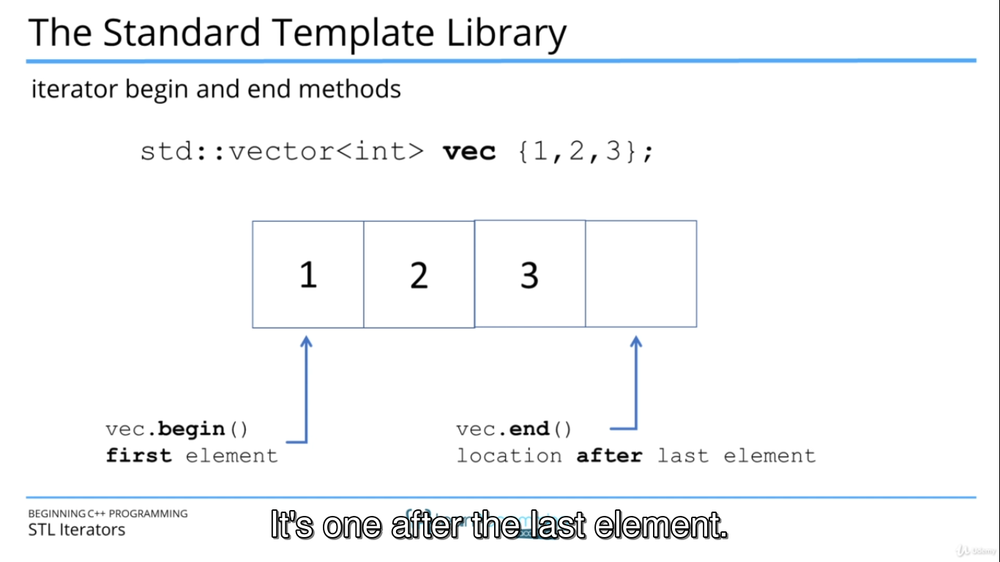
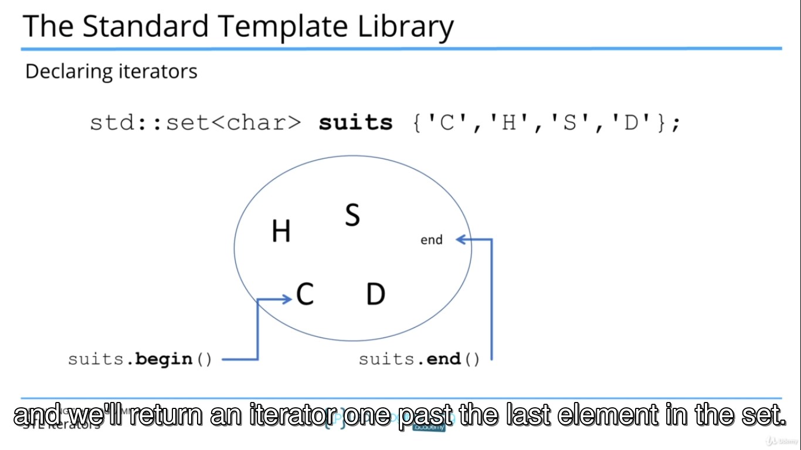
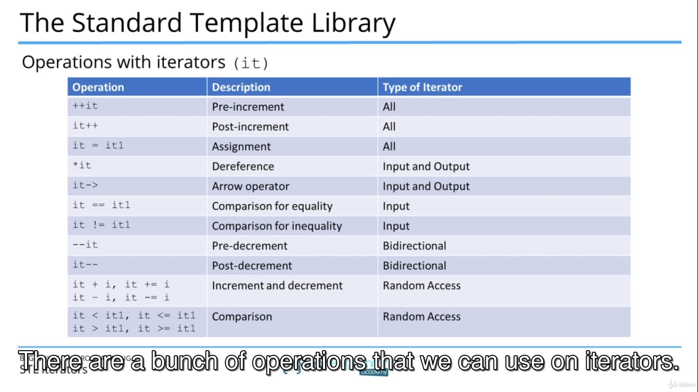
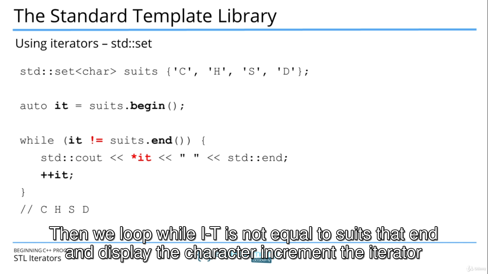
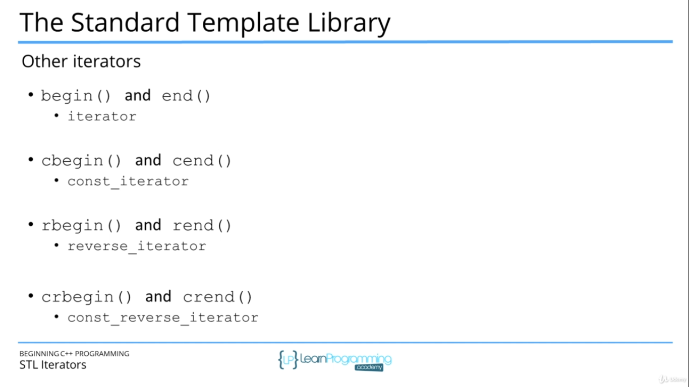
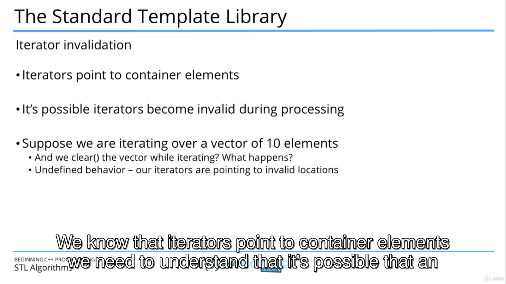
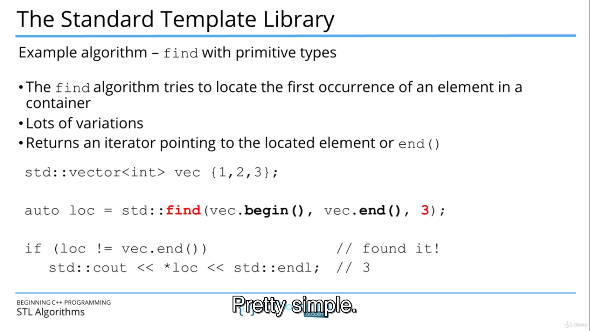
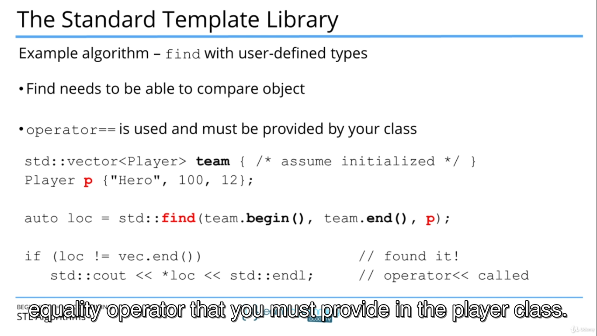

# Standard Template library in C++-

## Iterators-

+ Declaring a vector-
```c++
vector <int> vec {1, 2, 3};
```

+ vector points to the end as one element after the last element.


+ vec.begin() & vec.end() returns iterators, to the first and one after the last element respectively.

+ Declaring a set-
```c++
set <char> suits {'a', 'b', 'c', 'd'};
```

+ A set may or may not be in contiguous memory.
+ Suits.begin() points to the first element of the set and Suits.end() points to a position one element after the last element.


+ Another method  to use an iterator is-
```c++
vector<int> :: iterator it = vec.begin();

OR

auto it = vec.begin();  //More often used
```


```c++
vector<int> vec {1, 2, 3};

vector<int> :: iterator it = vec.begin();

while (it != vec.end())
{
	cout<<*it<<endl;
	++it;
}
```

+ Range based for loops-
```c++
for (auto it=vec.begin(); it != vec.end(); it++)
{
	cout<<*it<<endl;
}
```

+ Now for a set-


+ Now for a reverse iterator-
> Note that `it++` will decrement the pointer, if we have {1, 2, 3, 4} and vec.rbegin() points to 4 and on `i++` it will point to 3.

```c++
std::vector<int> vec {1,2,3};
std::vector<int>::reverse_iterator it = vec.rbegin();
while (it != vec.rend()) {
std::cout << *it << " ";
++it;
}

```

+ Other iterators-


+ To refer to the last element, we can do as follows-
```c++
auto it = vec.end() - 1;
```

+ What happens in a constant iterator?
We cannot change what a constant iterator is pointing to. Let's see through an example-

```c++
vector <int> :: const_iterator it = vec.begin();
// auto it = vec.cbegin();

while (it != vec.end)
{
	*it=0;  // Compiler error- read only
}
```

+ Iterators on list-
```c++
list<string> name {"chandan", "rishi", "ritu"};

auto it = name.crbegin();

while (it != name.crend())
{
	cout<<*it<<" ";
	it++;
}
```

+ Iterators on set-
```c++
map <string, string> favourite = {
								 {"chandan", "python"},
								 {"rishi", "c"},
								 {"ritu", "c++"}
								 };

auto it = favourite.begin();
while (it != favourite.end())
{
	cout<< it->first << ":" << it->second << endl;
	it++;
}
```

+ Iterate over a subset-
```c++
vector <int> vec {1, 2, 3, 4, 5, 6, 7, 8, 9};

auto start = vec.begin() + 2;
auto finish = vec.end() - 2;

while (start != finish)
{
	cout<<*it<<endl;
	it++;
}

```


# Introduction to STL Algorithms-
+ To use STL algorithms we need to include `<algorithm>`

+ Iterator invalidation-


+ **Find Algorithm-**


In above code, find tries to find element `3`, if it finds it, it will return an iterator pointing to 3 else it will point to the end of the container. We want to iterate from the beginning to the end of the container.

> Note that it returns the first occurence of the container.

+ If we want to use find for our own data types, we need to overload `==` operator-


+ **for_each-**


+ *Let's learn functor-*
```c++
struct square_functor
{
	void operator()(int x)  // overload () operator i.e open and close paranthesis
	{
		cout<<x*x<<" ";
	}
}

square_functor square;  // Function object

vector <int> vec {1, 2, 3};
for_each(vec.begin(), vec.end(), square);
```

+ Now doing the same using `function pointer`-
```c++
void square()
{
	cout<<x*x<<" "<<endl;
}

vector<int> vec {1, 2, 3};
for_each(vec.begin(), vec.end(), square);  // see we didn't gave parantheses with square
```

+ Now doing the same with a lambda expression-
```c++
for_each(vec.begin(), vec.end(), [](int x){cout<<x*x<<"	";});

OR
for_each(begin(vec), end(vec), [](int x){cout<<x*x<<" ";});

```

+ ```c++
class Person
{
	string name;
	int age;

public:
	Person(string name, int age):name(name), age(age){}

	bool operator == (const Person &obj)
	{
		return this.name == obj.name && this.age == obj.age;  // == operator overloaded to use in c
	}

list <Person> players = {
						{"Chandan", 20},
						{"Ritu", 21},
						{"Rishi", 22}
						}

auto loc = find(list.begin(), list.end(), Person {"Ritu", 21}) // Now this will find my object

}

+ `**count**` algorithm-
```c++
vector <int> vec {1, 2, 3, 1, 4, 1, 1};

value = count(vec.begin(), vec.end, 1); // This will return the number of occurences of 1.
```

+ `**count_if**` algorithm-
```c++
	vector <int> {1, 2, 3, 50, 100, 24}
	num = count_if(vec.begin(), vec.end(), [](int x){return x%2 != 0});  // returns true if an odd number
```

+ `**replace**` algorithm-
```c++
	vector<int> vec {1, 2, 3, 1, 4, 1};
	replace(vec.begin(), vec.end(), 1, 100);

	for (auto i : vec)
	{
		cout<<i<<" "<<endl;
	}
```

+ `**all_of**` algorithm-
```c++
	if (all_of(vec.begin(), vec.end(), [](int x){return x>=10})) //Checks if all elments are greater than 10 or not
		cout<<"True"<<endl;
	else
		cout<<"False";
```

+ There's another algorithm out there known as `**any_of**`-

+ **`Transform`** algorithm- It is for string transform-
```
#include <cctype>  //for toupper method

string str {"hello dear how are you?"};

transform(str.begin(), str.end(), str.begin(), ::toupper)  // make every character to get uppercase
```
> The 3rd begin is to say where to place the results
> And only the scope resolution says the global scope

--- 

# Array-
```c++
#include<array>

array <int, 5> arr1 {{1, 2, 3, 4, 5}}; // In c++11 we need two curly braces but in c++14 only one curly braces needed

//arr1 = {2, 3, 4, 5, 6};

cout<<arr1.size()<<endl;  //5
cout<<arr1.at(0)<<endl;  //1, It does bound check
cout<<arr1[0]<<endl;  //1 It does bound check
cout<<arr1.front()<<endl;  //1
cout<<arr1.back()<<endl;  //5
cout<<arr1.empty()<<endl;  //0, If empty returns 1
cout<<arr1.max_size()<<endl;  //5
cout<<arr1.fill(10)<<endl;  //5, fill array with 5
arr1.swap(arr2);  //swap two array with same size and type
int *data = arr1.data();  //to get access to underlying raw array
```

+ `**sort**` algorrithm-
```c++
sort(arr1.begin(), arr1.end());
```

+ `**max_element**` and `**min_element**` algorithms-
> Note that it return an iterator and not an element.
```c++
array<int, 5> :: iterator min_num = min_element(arr.begin(), arr.end());
auto max_num = max_element(arr.begin(), arr.end());

cout<<"Min Element- "<<*min_element<<"Max Element- "<<*max_element<<endl;
```

+ `**adjacent_find**`- This we use to find the first occurence of adjacent values
```c++
auto it = adjacent_find(arr1.begin(), arr1.end());

if (it != arr1.end())
{
	cout<<"Adjacent Item found with value: "<<*it<<endl;
}
```

+ `**accumulate**`- gives the sum of array
```c++
#include<numeric>

int sum = accumulate(arr1.begin(), arr2.end(), 0);  // It starts with zero, else we can start sum from whatever number one likes

cout<<"Sum= "<<sum<<endl;
```
--- 

# Vectors-


+ We add element using `push_back()` method.
+ Inserting element other than `back` is done in linear time complexity.
+ If there is no room for new element to allocate, vector will automatically allocate memory and usually twice the current size.
+ Let's see some of the functions-
```c++
vec.size() // Returns the no. of elements currently there in vector
vec.capacity() // Tells the current capacity of the vector
vec.max_size // The maximum number of elements it can hold
vec.at(0) // 
vec.[1] // 
vec.front() // return reference to 1st element i.e `l.front()=10` will change its value at front
vec.back() // 


//Person Class
Person p1 {"Rishi", 21};
vector <Person> vec;

vec.push_back(p1);
// IMPORTANT: All container classes makes copies of elements they store. So copy of p1 is made. 

vec.pop_back();
vec.pushback(Person("ritu", 20));  // Not creating a named object and hence is a move semantics
vec.emplace_back("Alviya", 19);  // efficient, it expects the arguments of person. It doesn't make any copies.
vec.empty();  // Returns true if empty
vec1.swap(vec2);  // swaps the two vectors, size doesn't matter
sort(vec.begin(), vec.end());
```

+ Insert elements at random places-
```c++
vector<int> vec1 {1, 2, 3, 4, 5};
vector<int> vec1 {10, 20, 30, 40, 50};

auto it = find(vec.begin(), vec.end(), 3);
vec1.insert(it, 1000); // 1, 2, 1000, 3, 4, 5, It added before 3
insert(it, vec2.begin(), vec2.end());  // 1, 2, 1000, 3, 10, 20, 30, 40, 50, 4, 5
```
> Just a note, whenever we work with our own classess, always overload `<` and `==` operator.

```c++
//Declaring Vectors-
vector<int> vec1 {1, 2, 3, 4};  // 1, 2, 3, 4

OR
vec = {2, 3, 4, 5}  // 2, 3, 4, 5

// five 100s in the vector
vector<int> vec1 (5, 100);  // 100, 100, 100, 100, 100
```

+ Some more methods-
```c++
vec.shrink_to_fit();  // It allocates memory to fit the size of vector

vec.reserve(100);  // Reserves 100 memory blocks for vector

vec.at(0) = 1000;
vec[1] = 2000;

vector<Person> vec1;
Person p1("rishi", 24);;
vec1.push_back(p1);
vec1.push_back(Person("ritu", 25));
vec1.push_back("chandan", 19)
vec1.clear();  // remove all elements
vec1.erase(vec1.begin(), vec.begin()+2);  // It will delete rishi and ritu and not chandan
```

+ Let's see more-
```c++
vector <int> vec {1, 2, 3, 4, 5, 6, 7, 8, 9, 10};
auto it = vec.begin();
while (it != vec.end())
{
	if (*it % 2 == 0)
		vec.erase(it);  // it will skip that item
	else
		++it;
}
```

+ `back_inserter` and `copy` methods-
```c++
vector vec1<int> {1, 2, 3, 4, 5};
vector vec2<int> {10,20};

copy(vec1.begin(), vec1.end(), back_inserter(vec2));  // It adds all elements from vec1 to the back of vec2

// Copy all even numbers-
copy_if(vec.begin(), vec.end(), back_inserter(vec2), [](int x){return x%2 == 0;})
```

+ `transform` method in vector-
```c++
vector<int> vec1 {1, 2, 3, 4, 5};
vector<int> vec2 {10, 20, 30, 40, 50};
vector<int> vec3 ;

transform(vec1.begin(), vec1.end(), vec2.begin(), back_inserter(vec3), [](int x, int y){return x*y;});
```

# Deque-


+ Declaring the deque-


```c++
deque<int> d;

d.front();  // returns reference to 1st element i.e `d.front()=10` will change its value at front
d.back();  // returns last element
d.push_back(10);  // push element at end
d.push_front(20);  // push element at front
```

+ deques are not in continuous memory. They can be assumed as linkedlist of vectors. These memory blocks are not in contiguous memory.


+ Let's see some coding-
```c++
deque<int> d {1, 2, 3};
d.size();  // returns the size of deque
d.max_size();  // a big number
d.at(0); // 1, has bound checking
d[1];  // 2, No bounds checking
```

+ Some more-
```c++
Person p1 {"mukesh", 24};

deque<Person> d;
d.push_back(p1);
d.pop_back();

d.push_front(Person("mukesh", 25));
d.pop_front();

d.emplace_back("anurag", 26);
d.emplace_front("jp", 24);
```

+ Want more? Yes-
```c++
deque<int> d (10, 1000); // Ten 1000s

vector<int> vec {1, 2, 3};

// Adding the vector at the end of deque
for (const auto &elem : vec)
{
	if (elem%2 == 0)
		d.push_back(elem);
	else
		d.push_front(elem);
}

d.clear();  // clears the deque

copy(vec.begin(), vec.end(), back_inserter(d));
copy(vec.begin(), vec.end(), front_inserter(d)); //Add all elements of vector at the front of deque
```

# Lists-


+ Something more about lists-


+ Visualize a list-


+ Elements are not contiguos in memory.
+ Better choice when you have lots of insertions and deletions. Insertion and deletion is also efficient at front and end as well as in between the list. But in between list, we have to first use an iterator to find where to insert.
+ Initialization of a list-

+ List common methods-
```c++
list<int> l {1, 2, 3};

l.size();  // Size of the list
l.max_size()  // a very large number
l.front()  // returns references to the front element i.e `l.front()=10` will change its value at front
l.back()  // return references to the last element
```

+ Some more methods-


+ Some coding part-
```c++
list<int> l = {1, 2, 3,  4, 5};

auto it = find(vec.begin(), vec.end(), 3); 

l.insert(it, 10);  // 1, 2, 10, 3, 4, 5 

// `it` is still referencing 3
l.erase(it);  // 1, 2, 10, 4, 5
l.resize(2);  // 1, 2, after 2 elements everything is removed
l.resize(5);  // 1, 2, 0, 0, 0

//iterating in lists-
cout<<*it;  // 3
it++;
cout<<*it;  // 4
it--;
cout<<*it;  // 3
```
+ A list can be understood as a doubly linked list.

### Difference between a list and a forward list-
+ It can called as a singly linked list.


+ It has no back() method as it has no sense of having back but can't transverse backwards.

+ Visualise forward_list-


+ Let's see some code-
```c++
l.size();  // Not available
l.max_size();  // a very large number
l.front();  // 
l.back();  // back not available

// Some more
l.push_front(p1);
l.pop_front();
l.emplace_front("Rishi", 24);

// We want more-
l.insert_after(it, 10);  // 1, 2, 3, 10, 4, 5
l.emplace_after(100);  // it is still pointing to 3, so inserted after it, 1, 2, 3, 100, 10, 4, 5
l.erase_after(it);  // erase 100
l.resize(2);  // 1, 2
l.resize(5);  // 1, 2, 3, 4, 5
```

+ It didn't end here-
```c++
list<int> l1 {1, 2, 3, 4, 5};
list<string> l2;
l2.push_back("back");
l2.push_front("front");

list<int> l3 (10, 1000);  // Ten 1000s

```

+ More More More-
```c++
class Person
{
	Person()  // Extra addition to previous Person class
	{
		name = "unknown";
		age = 0;
	}
};

list<Person> persons;
persons.resize(5);  // uses the person default constructor
```
> So, it's important to note here that we need to overload the `==`, `<`, `default constructor`

+ Something more intresting-
```c++
list<int> l1 {1, 2, 3, 4, 5, 6, 7, 8, 9, 10};
list<int> l2 {1000, 2000, 3000};

auto it = find(l1.begin(), l1.end(), 5);

if (it != l1.end())
	l1.insert(it, 100);  // 1, 2, 3, 4, 100, 5, 6, 7, 8, 9, 10

l1.insert(it, l2.begin(), l2.end());  // 1, 2, 3, 4, 100, 1000, 2000, 3000, 5, 6, 7, 8, 9, 10

advance(it, -4);  // takes it to point to 100, `advance iterators`

l1.erase(it);  // removes 100 and now iterator becomes invalid
```

+ Test 5-
```c++
list <string> l {
				{"chandan", 21},
				{"ritu", 24},
				{"rishi", 25}
				};

string name;
int age;
cout<<"Enter name and age: ";
getline(cin, name);
cin>>age;

l.emplace_back(name, age);

// add anurag before ritu
auto it = find(l.begin(), l.end(), Person {"ritu", 24});

if (it != l.end())
	l.emplace(it, "anurag", 26);  // Another way of doing it

// We can also sort and for that only we overloaded the `<` operator
l.sort();  // We can do here for ages
```

--- 
# Sets-


+ Some more introduction-


+ Initialization-


+ Set doesn't hold duplicate items, so if we even put duplicate items, it will not give an error and will result in a proper set.
```c++
set <int> s {1, 4, 5, 3, 3, 2};  // 1, 2, 3, 4, 5

s.size();  // it gives the size
s.max_size();  // a very large number
s.insert(7);  // 1, 2, 3, 4, 5, 7
```

+ No concept of front and back.

+ Check whether an element added into the set or not-


+ Let's see some code-
```c++
s.erase(3);  // 1, 2, 4, 5

auto it = find(5);
if (it != s.end())
	s.erase(it);  // 1, 2, 4

s.count(1);  // It gives how many times an item is there in a set. Better to use it if an element exists or not. 1-present, 0-absent

s.clear();  // empty the set
s.empty();  // checks if set is empty or not
```

# Multiset-


+ Already there in `set` header file.

+ Unordered sets-


+ Unordered multisets-


+ **It is important to overload `<` operator in set for ordering.**

+ Some more coding-
```c++
s.insert(0);
s.insert(10);

if (s.count(10))
	cout<<"10 is there inside set";

auto it = set.find(5);  // this is better to use as it knows how a set has been implemented.

if (it != set.end())
	cout<<"Item found!"<<endl;
	
// Let's give some more tests-
set <Person> s {
			   {"chandan", 20},
			   {"ritu", 26},
			   {"rishi", 25}
			   };

s.emplace("anurag", 35);

s.emplace("tim", 35); // No, 35 already exists

auto it = find(Person("XXXX", 35));

if (it != s.end())
	s.erase(it);  // anrag will be removed :(, should not happen, as it is using `<` operator
```

+ Concept of pair in sets-
```c++
set <string> s {"A", "B", "C"};

auto result = s.insert("D");  // Result is returned as pair

cout<<"first: "<<*(result.first)<<endl;  // first contains an iterator to what we inserted
cout<<"second: "<<result.second<<endl;  // tells whether item inserted or not, i.e true or false
```
--- 

# Map-
